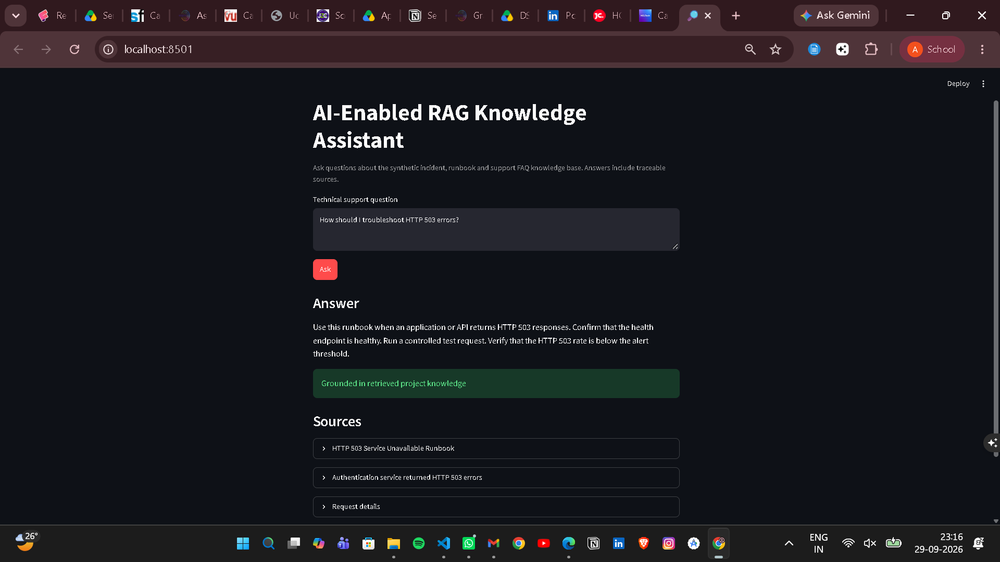
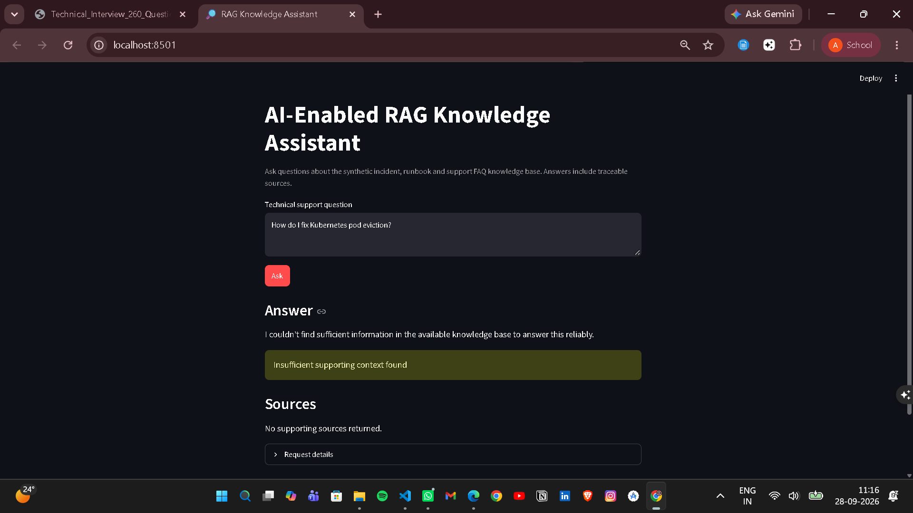

# AI-Enabled RAG Knowledge Assistant

[](https://github.com/Anjalisingh127/ai-rag-knowledge-assistant/actions/workflows/ci.yml)


A portfolio-scale **Retrieval-Augmented Generation (RAG)** application for technical-support knowledge search. It retrieves evidence from a controlled incident/runbook/FAQ knowledge base, checks whether the evidence is sufficient, and returns either a grounded troubleshooting response with traceable sources or a safe abstention.

The project is designed to demonstrate practical software-engineering work around RAG: modular architecture, local semantic retrieval, measurable evaluation, failure handling, automated tests, API/UI integration, and reproducible validation.

> **Current status:** Core RAG pipeline, MiniLM + FAISS semantic retrieval, grounding, retrieval evaluation, FastAPI, Streamlit, automated tests, local end-to-end validation, GitHub Actions CI, Docker containerization, and public Streamlit deployment are complete.

---

## Quick Links

- [Live demo](https://anjali-rag-knowledge-assistant.streamlit.app)
- [Repository](https://github.com/Anjalisingh127/ai-rag-knowledge-assistant)
- [GitHub Actions](https://github.com/Anjalisingh127/ai-rag-knowledge-assistant/actions)
- [Architecture](docs/architecture.md)
- [Evaluation methodology](docs/evaluation.md)
- [Known limitations](docs/limitations.md)
- [Hash baseline report](reports/retrieval_metrics_hash.json)
- [MiniLM evaluation report](reports/retrieval_metrics_minilm.json)
- [License](LICENSE)

---

## What This Project Demonstrates

- Local semantic retrieval using **Sentence Transformers (MiniLM)** and **FAISS**
- Grounding checks before answer generation
- Safe abstention for unsupported questions
- Source-aware responses with traceable document metadata
- Independent retrieval evaluation using **Hit Rate@K, Recall@K, and MRR**
- FastAPI endpoints for health, retrieval, querying, sources, and evaluation
- Streamlit interface for interactive technical-support questions
- Public Streamlit Community Cloud deployment using in-process MiniLM + FAISS retrieval
- Deterministic hash embeddings for lightweight testing and CI
- Optional OpenAI and Ollama generation paths
- Automated testing with pytest and code-quality checks with Ruff
- GitHub Actions CI on pushes and pull requests to `main`

All incident and operational records in this repository are synthetic.

---

## Measured Retrieval Results

The benchmark contains **30 queries**:

- **25 answerable technical-support queries**
- **5 intentionally unsupported queries**
- **Top-K = 5**

| Retrieval strategy | Hit Rate@5 | Recall@5 | MRR | Answerable retrieval failures |
| --- | ---: | ---: | ---: | ---: |
| Deterministic hash baseline | 92% | 92% | 0.6013 | 2 |
| MiniLM semantic embeddings | **100%** | **100%** | **0.9200** | **0** |

Both strategies are evaluated on the same curated corpus and query set. Evaluation files are explicitly excluded from ingestion to prevent benchmark leakage.

> These are **retrieval metrics**, not a claim of “100% RAG accuracy.” Hit Rate@5 and Recall@5 measure whether expected evidence appears within the top five retrieved results; MRR measures how highly the first expected source is ranked.

---

## End-to-End Behavior

The validated local application path is:

```text
User
  |
  v
Streamlit UI
  |
  v
FastAPI / RAG Service
  |
  v
MiniLM Query Embedding
  |
  v
FAISS Top-K Retrieval
  |
  v
Grounding / Evidence Sufficiency Check
  |
  +-----------------------------+
  |                             |
  v                             v
Sufficient Context        Insufficient Context
  |                             |
  v                             v
Context Generation             Abstain
  |                             |
  v                             v
Answer + Sources        No Unsupported Sources
```

### Supported-query example

```text
How should I troubleshoot HTTP 503 errors?
```

The system retrieves relevant support documentation, returns a grounded troubleshooting response, and exposes supporting sources.

### Unsupported-query example

```text
How do I fix Kubernetes pod eviction?
```

Kubernetes troubleshooting is outside the current knowledge base, so the system returns an insufficient-context response and does not present unrelated documents as supporting evidence.

This behavior has been validated locally through the Streamlit UI and FastAPI-backed RAG service, and publicly through the Streamlit Community Cloud deployment.

## Application Demo

**Live application:** [anjali-rag-knowledge-assistant.streamlit.app](https://anjali-rag-knowledge-assistant.streamlit.app)

The public deployment runs the same RAG service in-process inside Streamlit Community Cloud, using local MiniLM embeddings, FAISS retrieval, grounding checks, deterministic context generation, and source traceability without requiring a paid API.

### Grounded response for a supported query

The HTTP 503 example shows the validated supported-query path: retrieval succeeds, the answer is marked as grounded, and the UI exposes the supporting runbook and incident sources.



### Safe abstention for an unsupported query

The Kubernetes example shows the failure-handling path: the knowledge base does not contain sufficient support for the question, so the system abstains and returns no misleading supporting sources.



---

## Architecture

See [docs/architecture.md](docs/architecture.md) for the validated local/Docker path, the public in-process Streamlit path, and the isolated evaluation flow.

---

## Technology Stack

| Layer | Technology |
| --- | --- |
| Language | Python 3.12 |
| API | FastAPI |
| Validation / configuration | Pydantic, Pydantic Settings |
| RAG components | LangChain Core / Community |
| Embeddings | Sentence Transformers, `all-MiniLM-L6-v2` |
| Vector search | FAISS |
| Test embeddings | Deterministic local hash embeddings |
| Generation | Context-only fallback, optional OpenAI, optional Ollama |
| UI | Streamlit |
| HTTP client | HTTPX |
| Testing | pytest, pytest-cov |
| Code quality | Ruff |
| CI | GitHub Actions |
| Containerization | Docker, Docker Compose |
| Public deployment | Streamlit Community Cloud |
| Document support | Markdown, JSON, CSV, PDF |

The validated portfolio path uses local MiniLM embeddings and FAISS, so the primary retrieval workflow does not require a paid API.

---

## Knowledge Base and Ingestion

The searchable knowledge base contains synthetic technical-support content covering:

- HTTP 503 and service availability
- database timeout and connection issues
- authentication failures
- slow API responses
- network connectivity and DNS failures
- troubleshooting, validation, and escalation guidance

Searchable directories:

```text
data/incidents/
data/runbooks/
data/faq/
```

The benchmark is kept separately under:

```text
data/evaluation/
```

The current local build loads **16 knowledge documents** and produces **25 indexed chunks**. Chunk metadata preserves fields needed for source traceability.

---

## RAG Design

### 1. Ingestion

Supported knowledge files are loaded from the configured corpus directories. Evaluation data is excluded from ingestion.

### 2. Chunking

Documents are split into overlapping character-based chunks while preserving source metadata and text integrity.

### 3. Embedding

The primary semantic path uses `sentence-transformers/all-MiniLM-L6-v2`.

A deterministic local hash embedding implementation is retained for lightweight tests and CI.

### 4. Retrieval

FAISS indexes chunk embeddings and returns the Top-K semantically relevant chunks for each question.

### 5. Grounding

Retrieved chunks are checked for sufficient lexical coverage before generation is allowed. This reduces the chance of weakly related retrieval results being presented as reliable evidence.

### 6. Generation

The default context generator provides deterministic extractive responses for free local demos and tests while filtering internal metadata and raw JSON fields.

Optional OpenAI and Ollama generators are supported through configuration.

### 7. Source Traceability

Grounded responses retain source metadata so users can inspect which runbooks, incident records, or FAQ documents supported the answer.

---

## API

The FastAPI service exposes:

| Method | Endpoint | Purpose |
| --- | --- | --- |
| `GET` | `/health` | Check service and vector-store readiness |
| `POST` | `/api/retrieve` | Retrieve relevant knowledge chunks |
| `POST` | `/api/query` | Run the grounded RAG workflow |
| `GET` | `/api/sources` | Inspect available knowledge sources |
| `POST` | `/api/evaluate` | Run the MiniLM retrieval benchmark |

Run the API:

```bash
uvicorn app.api.app:app --reload
```

Then open:

- API base: [http://localhost:8000](http://localhost:8000)
- OpenAPI / Swagger UI: [http://localhost:8000/docs](http://localhost:8000/docs)
- Health endpoint: [http://localhost:8000/health](http://localhost:8000/health)

---

## Streamlit Interface

Start the UI after the API is running:

```bash
streamlit run app/streamlit_app.py
```

Then open:

- Streamlit UI: [http://localhost:8501](http://localhost:8501)

The interface displays:

- the submitted support question;
- the generated or abstained response;
- grounded / insufficient-context status;
- source documents;
- request timing and provider details.

---

## Project Structure

```text
ai-rag-knowledge-assistant/
├── app/
│   ├── api/             # FastAPI app, routes, schemas and dependencies
│   ├── core/            # configuration, logging and exceptions
│   ├── evaluation/      # metrics and retrieval evaluation
│   ├── ingestion/       # document loading and chunking
│   └── rag/             # embeddings, FAISS, retrieval, grounding, generation
├── data/
│   ├── incidents/       # synthetic incident records
│   ├── runbooks/        # troubleshooting runbooks
│   ├── faq/             # support FAQ
│   └── evaluation/      # isolated benchmark dataset
├── docs/                # architecture, evaluation and limitations
├── reports/             # measured retrieval reports
├── scripts/             # indexing, evaluation and smoke-test utilities
├── tests/               # automated test suite
├── .github/workflows/   # CI workflow
├── .env.example
├── pyproject.toml
├── LICENSE
├── Dockerfile.api
├── Dockerfile.ui
├── docker-compose.yml
└── README.md
```

---

## Local Setup

### 1. Clone

```bash
git clone https://github.com/Anjalisingh127/ai-rag-knowledge-assistant.git
cd ai-rag-knowledge-assistant
```

### 2. Create and activate Python 3.12 environment

Windows PowerShell:

```powershell
py -3.12 -m venv .venv
.\.venv\Scripts\Activate.ps1
```

### 3. Install dependencies

Development and test dependencies:

```bash
python -m pip install --upgrade pip
pip install -e ".[dev]"
```

Validated local MiniLM path:

```bash
pip install -e ".[dev,local]"
```

### 4. Configure environment

```powershell
Copy-Item .env.example .env
```

Local secrets are read from environment configuration. `.env` is ignored by Git.

### 5. Build the FAISS index

```bash
python scripts/build_index.py
```

### 6. Start the API

```bash
uvicorn app.api.app:app --reload
```

### 7. Start Streamlit

In a second terminal:

```bash
streamlit run app/streamlit_app.py
```

---

## Docker

The validated local application is containerized as two services:

- **rag-api** — FastAPI + MiniLM + FAISS
- **rag-ui** — Streamlit frontend

The API image builds the local FAISS index during image creation and exposes port `8000`. The UI communicates with the API over the internal Docker Compose network and exposes port `8501`.

Build both images:

```bash
docker compose build
```

Start the stack:

```bash
docker compose up -d
```

Check container status:

```bash
docker compose ps
```

Validate the API:

```powershell
Invoke-RestMethod http://localhost:8000/health
```

Validated container behavior:

```text
API container                 PASS
UI container                  PASS
API healthcheck               PASS
UI waits for healthy API      PASS
MiniLM + FAISS retrieval      PASS
HTTP 503 grounded flow        PASS
Unsupported-query abstention  PASS
```

The Compose configuration uses an API healthcheck, and the Streamlit service starts only after the API reports healthy.

---

## Evaluation

Run the deterministic baseline:

```bash
python scripts/run_evaluation.py --embedding hash
```

Run semantic MiniLM evaluation:

```bash
python scripts/run_evaluation.py --embedding minilm
```

Reports:

- [Hash baseline](reports/retrieval_metrics_hash.json)
- [MiniLM semantic evaluation](reports/retrieval_metrics_minilm.json)
- [Evaluation methodology](docs/evaluation.md)

---

## Testing and CI

Run the local quality gates:

```bash
ruff check .
pytest -q
python scripts/test_local_retrieval.py
```

Current validated checkpoint:

```text
Ruff                         PASS
pytest                       19 passed
Retrieval smoke test         PASS
Indexed chunks               25
MiniLM Hit Rate@5            100%
MiniLM Recall@5              100%
MiniLM MRR                   0.92
MiniLM retrieval failures    0
Supported-query grounding    PASS
Unsupported-query abstention PASS
GitHub Actions CI            PASS
```

GitHub Actions runs Ruff and pytest for pushes and pull requests to `main`.

The CI environment intentionally remains lightweight: semantic MiniLM support is optional and is loaded only when that evaluation strategy is requested, allowing deterministic test paths to run without downloading the transformer model.

[View CI workflow runs](https://github.com/Anjalisingh127/ai-rag-knowledge-assistant/actions)

---

## Engineering Decisions

**Evaluation isolation**  
The evaluation dataset is not searchable knowledge. This prevents benchmark leakage and inflated retrieval metrics.

**Measured retrieval instead of vague accuracy**  
Retrieval is reported using Hit Rate@K, Recall@K, and MRR instead of an undefined end-to-end “accuracy” percentage.

**Ground before generation**  
Retrieved content must meet a relevance threshold before generation is allowed. Unsupported questions can therefore abstain instead of presenting weak evidence as fact.

**Local-first design**  
MiniLM and FAISS provide a useful semantic retrieval path without requiring a paid embedding service.

**Deterministic CI**  
Hash embeddings support fast, reproducible automated tests. Optional MiniLM dependencies are loaded only when required.

**Provider separation**  
Embedding and generation providers are independently configurable rather than tightly coupled to one vendor.

**Source traceability**  
Retrieved chunks preserve metadata so evidence can be exposed alongside grounded answers.

---

## Current Limitations

This is a portfolio-scale application, not a production support platform.

Current limitations:

- synthetic rather than production incident data;
- a small domain-specific evaluation set;
- local FAISS rather than a distributed vector database;
- character-based rather than token-aware chunking;
- no BM25/hybrid retrieval or reranking implementation yet;
- no authentication or authorization layer;
- no live ServiceNow/ticketing-system integration;
- OpenAI and Ollama paths are configurable but are not part of the validated local E2E benchmark.

See [docs/limitations.md](docs/limitations.md).

---

## Completed Milestones

- [x] Project configuration and environment setup
- [x] Synthetic technical-support knowledge base
- [x] Multi-format ingestion foundation
- [x] Chunking and source metadata
- [x] FAISS vector retrieval
- [x] Deterministic hash embedding baseline
- [x] Local Sentence Transformer embeddings
- [x] Grounded context/generation layer
- [x] Unsupported-query abstention
- [x] FastAPI service
- [x] Streamlit interface
- [x] Retrieval evaluation framework
- [x] Evaluation-data isolation
- [x] Hash-vs-MiniLM benchmark
- [x] 19-test automated suite
- [x] Ruff quality gate
- [x] GitHub Actions CI
- [x] Optional MiniLM dependency lazy-loading for lightweight CI
- [x] Local API + MiniLM/FAISS E2E validation
- [x] Supported-query UI validation
- [x] Unsupported-query UI validation
- [x] Retrieval reports committed
- [x] Portfolio UI screenshots added to repository documentation
- [x] Dockerized FastAPI service
- [x] Dockerized Streamlit interface
- [x] Docker Compose networking and API healthcheck
- [x] Local container end-to-end validation
- [x] Public Streamlit Community Cloud deployment
- [x] Public supported-query grounding validation
- [x] Public unsupported-query abstention validation

---

## Next Steps

- Expand the evaluation dataset beyond the current curated benchmark.
- Add hybrid retrieval or reranking only if measured evaluation shows a meaningful benefit.
- Explore integration with a real support or ticketing data source.
- Keep resume and portfolio claims limited to measured, validated functionality.

---

## Documentation

- [Architecture](docs/architecture.md)
- [Evaluation methodology](docs/evaluation.md)
- [Known limitations](docs/limitations.md)
- [Hash retrieval report](reports/retrieval_metrics_hash.json)
- [MiniLM retrieval report](reports/retrieval_metrics_minilm.json)
- [CI workflow](.github/workflows/ci.yml)

---

## License

This project is licensed under the [MIT License](LICENSE).
